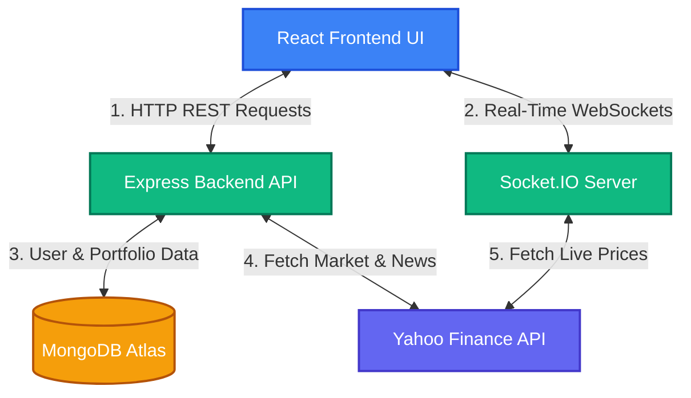
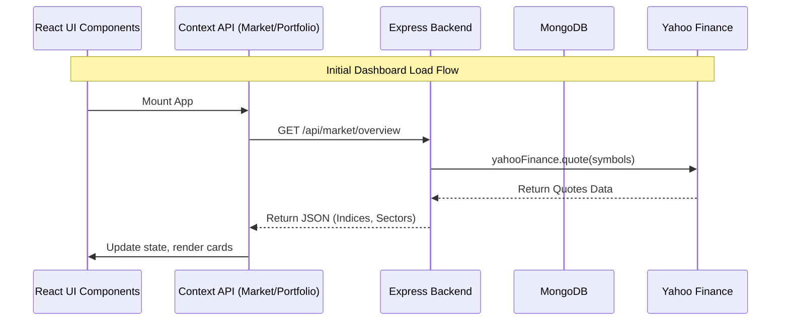
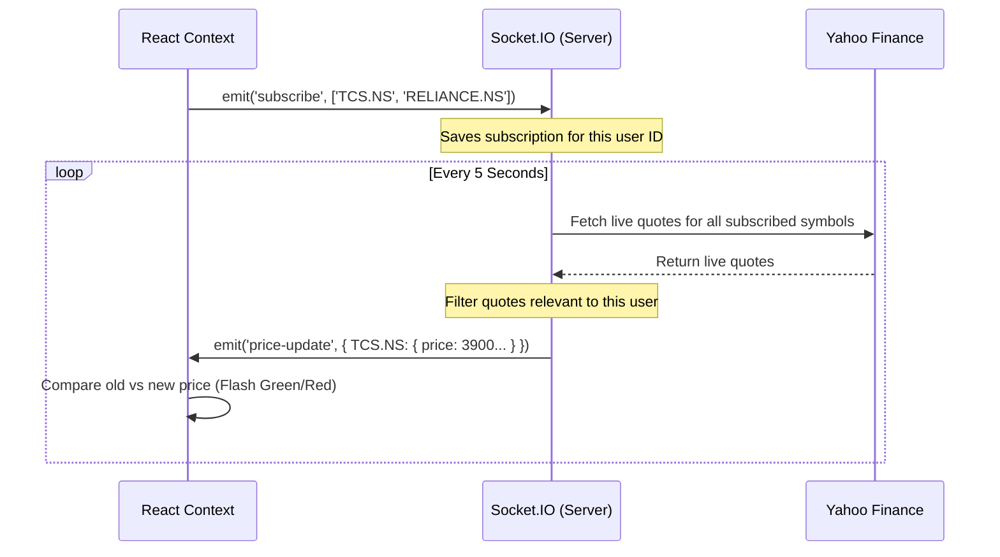

# MarketPulse Data Flow & Architecture

This document outlines the complete workflow of how data moves through your website, from external data sources down to the visual components on the user's screen.

---

## 1. High-Level Architecture

Your application follows a modern **MERN** (MongoDB, Express, React, Node.js) architecture with an added **WebSocket** layer for real-time streaming, and an external data integration using **Yahoo Finance**.

---

## 2. The Initial Load (REST API Flow)

When a user first opens the dashboard, the frontend needs to grab the initial state of the market, news, and the user's portfolio. This is done using standard HTTP requests.

1. **Frontend Context Initialization:** `MarketContext.jsx` and `PortfolioContext.jsx` run their `useEffect` hooks as soon as the app loads.
2. **API Requests:** 
   - `MarketContext` calls `GET /api/market/overview` and `GET /api/news`.
   - `PortfolioContext` calls `GET /api/portfolio` (using the JWT token for authentication).
3. **Backend Processing:** 
   - The `/overview` route queries `yahoo-finance2` for index prices, sector ETFs, and the top active NSE stocks.
   - The `/portfolio` route checks the JWT token, extracts the user ID, and queries the **MongoDB Portfolio Model** to retrieve saved holdings and watchlists.
4. **State Update:** The backend responds with JSON. The React Contexts update their state variables (`gainers`, `sectors`, `watchlist`, etc.), causing the UI components to render the data on screen.

---

## 3. Real-Time Price Streaming (WebSocket Flow)

Instead of the client constantly asking the server "are there new prices?", we use WebSockets to maintain an open connection. The server pushes new prices to the client automatically.

1. **Subscription:** Once the `MarketContext` and `PortfolioContext` receive their initial data (e.g., they know the user owns `TCS.NS`), they send a message to the Socket server: `socket.emit('subscribe', ['TCS.NS', '^NSEI'])`.
2. **Server Registration:** The `server/index.js` receives this and adds the client to an `activeSubscriptions` Map.
3. **Background Polling:** Every 5 seconds, the backend collects all unique symbols requested by all connected users and asks Yahoo Finance for their latest prices.
4. **Targeted Emission:** The backend calculates which clients asked for which symbols, and emits a `price-update` event specifically to them.
5. **UI Flash:** The frontend receives the `price-update`. It compares the new price to the old price. If it's higher, it sets `flashDirection = 'up'` (flashing green). If lower, `down` (flashing red).

---

## 4. User Interaction & Data Mutation

When a user actively changes data, such as adding a stock to their watchlist or buying a holding, the data flows from the UI back to the database.

1. **User Action:** User clicks "Add to Watchlist" on `TCS.NS`.
2. **Context Trigger:** The UI calls `addToWatchlist(stock)` inside `PortfolioContext.jsx`.
3. **Database Save:** The Context makes a `POST /api/portfolio/watchlist` request to the backend. The backend finds the user's document in MongoDB, adds the symbol, and saves the document.
4. **WebSocket Registration:** The Context updates its local React state. Because the state changed, a `useEffect` hook runs, sending a new `socket.emit('subscribe', ['TCS.NS'])` so the system knows to start streaming live prices for this newly added stock.

> [!TIP]
> This separation of concerns means your UI components (like `HeroCards` or `StockChart`) don't actually know *how* data is fetched. They simply read variables from the Context, making your UI extremely clean and easy to modify.
